# API REST - Gestión de Tareas del Hogar

## Descripción del Proyecto
Esta API REST permite gestionar tareas del hogar de manera eficiente. Se implementa con **Kotlin y Spring Boot** utilizando **MongoDB** como base de datos.

### 📂 Colecciones en MongoDB

#### **1. Usuario**
Cada usuario registrado en la aplicación tendrá los siguientes campos:

- **_id:** Identificador único generado por MongoDB.
- **username:** String único y obligatorio.
- **password:** String cifrada.
- **email:** String único y obligatorio.
- **roles:** Puede ser `USER` o `ADMIN`.
- **direccion:** Un objeto con los datos de la ubicación del usuario.

#### **2. Dirección** (Subdocumento dentro de `usuarios`)
La dirección del usuario se almacena como un subdocumento con los siguientes campos:

- **calle:** Nombre de la calle.
- **cumero:** Número de la vivienda.
- **ciudad:** Ciudad en la que reside el usuario.
- **municipio:** Municipio correspondiente.
- **provincia:** Provincia de residencia.
- **cp:** Código postal.

#### **3. Tareas**
Cada tarea creada por un usuario o asignada por un administrador tendrá los siguientes campos:

- **_id:** Identificador único generado por MongoDB.
- **titulo:** String obligatorio.
- **desc:** String opcional.
- **estado:** Puede ser `PENDING` (pendiente) o `DONE` (completada).
- **usuario:** Identificador del usuario que tiene la tarea.
- **fechCreacion:** Fecha en la que se creó la tarea.
- **fechActualizacion:** Fecha de la última modificación.

---

## Enumeraciones (`Enums`)

### **Rol de Usuario (`Roles`)**
- `USER`: Usuario regular con permisos limitados.
- `ADMIN`: Administrador con permisos elevados.

### **Estado de Tarea (`TaskStatus`)**
- `PENDING`: La tarea aún no ha sido completada.
- `DONE`: La tarea ha sido marcada como completada.

---

## Endpoints de la API

### **1. Usuarios (`/users`)**
| Método   | Endpoint             | Descripción                                                                                                                       |
|----------|----------------------|-----------------------------------------------------------------------------------------------------------------------------------|
| `GET`    | `/usuarios/{id}`     | Obtiene la información de un usuario por ID, un admin puede obtener cualquier información  y un usuario estandard solo la suya. |
| `GET`    | `/usuarios`          | Solo para ADMIN, obtiene todos los usuarios.                                                                                      
| `POST`   | `/usuarios/register` | Registra un nuevo usuario.                                                                                                        |
| `POST`   | `/usuarios/login`    | Inicia sesión y devuelve un token JWT.                                                                                            |
| `DELETE` | `/usuarios`    | Elimina un usuario, un ADMIN podrá eliminar a cualquier usuario.                                                                  |
| `PUT`    | `/usuarios`    | Actualiza un usuario, un ADMIN podrá actualizar a cualquier usuario.  

---

### **2. Tareas (`/tasks`)**
| Método | Endpoint       | Descripción |
|--------|----------------|-------------|
| `GET`  | `/tareas`      | Un usuario obtiene sus propias tareas. Un ADMIN obtiene todas. |
| `GET`  | `/tareas/{id}` | Obtiene una tarea por ID (solo si pertenece al usuario o si es ADMIN). |
| `POST` | `/tareas`      | Un usuario crea una tarea para sí mismo, un ADMIN puede crear para cualquier usuario. |
| `PUT`  | `/tareas/{id}` | Un usuario actualiza el estado de su tarea a `DONE`. Un ADMIN puede actualizar cualquier tarea. |
| `DELETE` | `/tareas/{id}` | Un usuario elimina su propia tarea. Un ADMIN puede eliminar cualquier tarea. |

---

## Lógica de Negocio

1. **Registro y Login:**
    - Cualquier persona puede registrarse y loguearse.
    - Se genera un token JWT tras el login.

2. **Gestión de Usuarios:**
    - Los usuarios pueden ver su propio perfil.
    - Los ADMIN pueden ver todos los usuarios.

3. **Gestión de Tareas:**
    - Los usuarios pueden **crear, ver, completar, actualizar y eliminar sus propias tareas**.
    - Los ADMIN pueden **ver, asignar, completar, actualizar y eliminar tareas de cualquier usuario**.

---

## Excepciones y Códigos de Estado

| Código | Descripción |
|--------|-------------|
| `200 OK` | Operación exitosa. |
| `201 Created` | Recurso creado exitosamente. |
| `400 Bad Request` | Datos inválidos o formato incorrecto. |
| `401 Unauthorized` | No autenticado o token inválido. |
| `403 Forbidden` | Acceso denegado por permisos insuficientes. |
| `404 Not Found` | Recurso no encontrado (usuario o tarea). |
| `500 Internal Server Error` | Error inesperado. |

---

## Pruebas Gestión Usuarios

### Configuración de la conexión a Mongo

Se ha usado una variable de entorno para configurar la URI de MongoDB, además se han añadido las clases necesarias para gestionar la conexión a la base de datos usando Spring (Controller, Service y Repository)

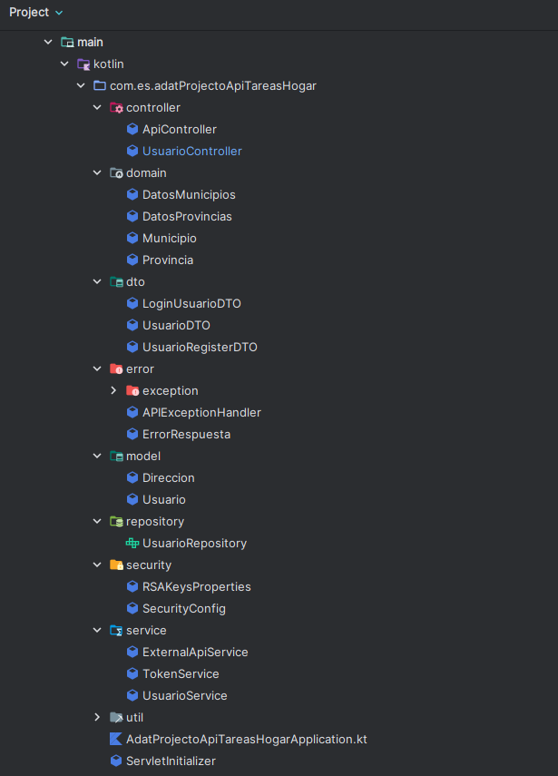

### Implementación de los endpoints relativos a realizar login y registro

Se han implementado los endpoints necesarios para realizar un login y registro asi como las posibles excepciones que estos endpoints pueden levantar.

 - `POST` `/usuarios/login`: Las posibles respuestas son 201 created, 401 unathorized o 500 internal server error.
 - `POST` `/usuarios/register`: Las posibles respuestas son 201 created, 401 unathorized o 500 internal server error.

El proceso de login da como resultado un token JWT que permite al usuario autorizarse en futuras peticiones.

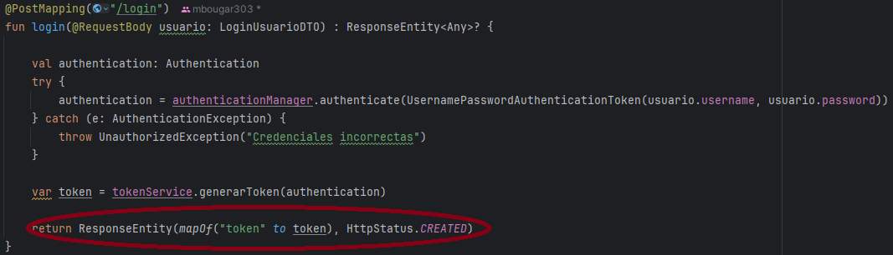

### Pruebas de correcto funcionamiento de la gestión de usuarios de la API

#### Login

 - 201 Created: El usuario ha podido iniciar sesion correctamente y devuelve el token.

Imagen Insomnia:

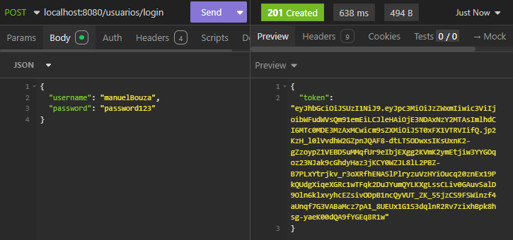

Imagen APP:

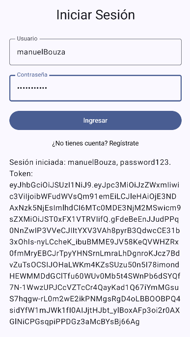

Imagen BBDD:

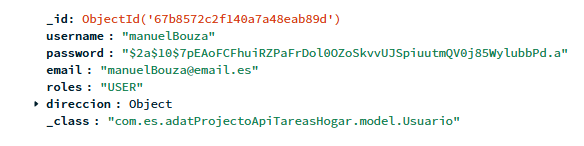

 - 401 Unauthorized: El usuario ha introducido credenciales incorrectas.

Imagen Insomnia:

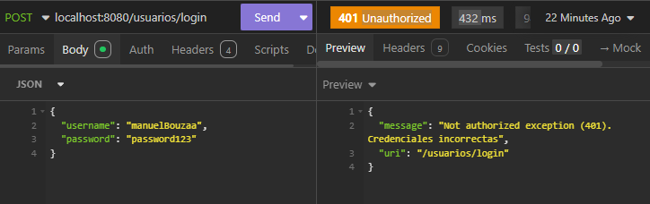

Imagen APP:

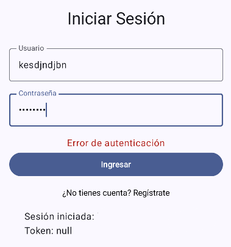

- 500 Internal Server Error: Ha ocurrido un error insesperado o no se ha enviado un body (no es posible obtenerlo desde la app).

Imagen Insomnia:

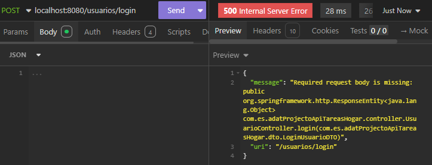

#### Register

- 201 Created: El usuario ha podido crear un usuario correctamente.

Imagen Insomnia:

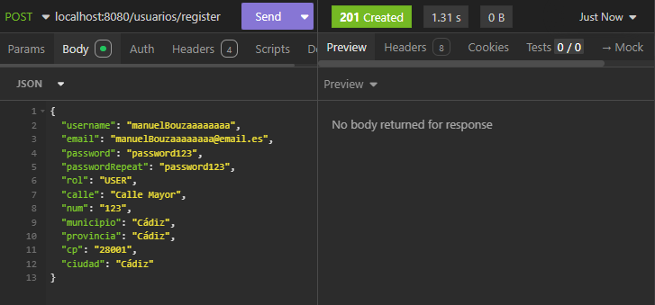

Imagen APP:

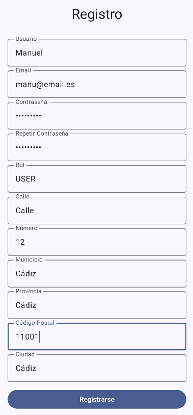

Imagen BBDD (la primera imagen muestra el usuario creado con insomnia y la segunda el usuario creado con la app):

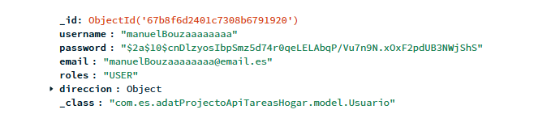

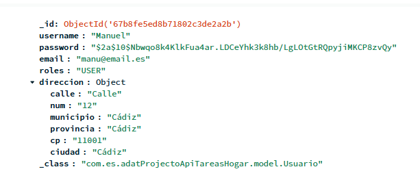

- 400 Bad Request: El usuario ha introducido datos inválidos, esta excepción puede ser levantada por multiples razones (usuario repetido, correo repetido, municipio o provincia inválidos, contraseñas no iguales, campos vacíos o email inválido).

Imagen Insomnia:

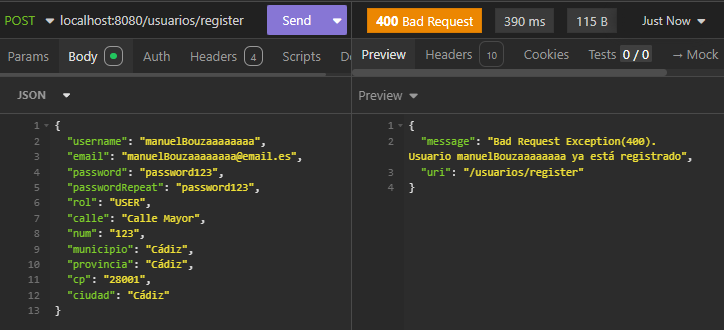

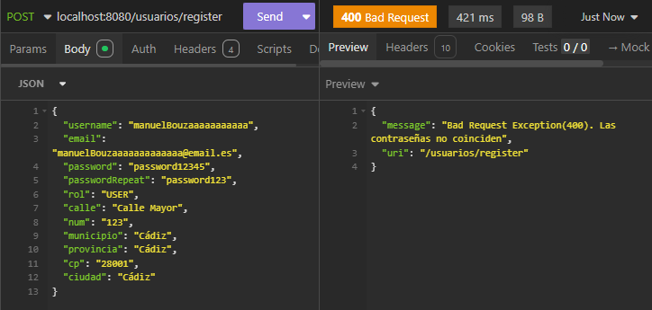

Imagen APP (las contraseñas no coinciden):

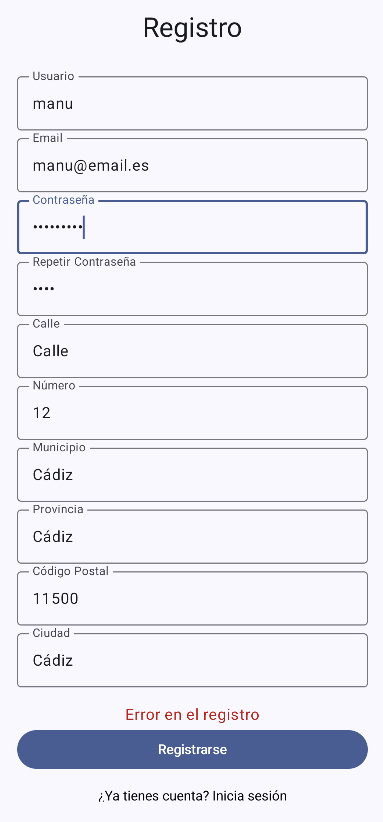

- 500 Internal Server Error: Ha ocurrido un error insesperado o no se ha enviado un body (no es posible obtenerlo desde la app).

Imagen Insomnia:

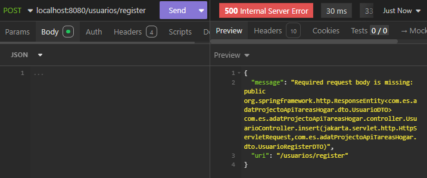
